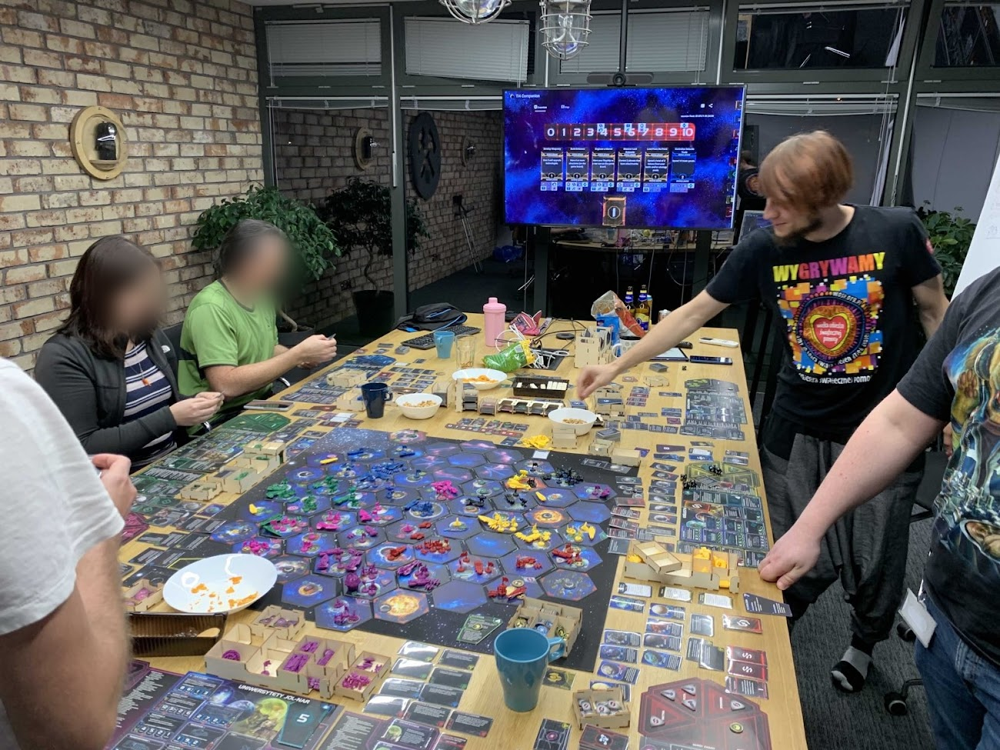
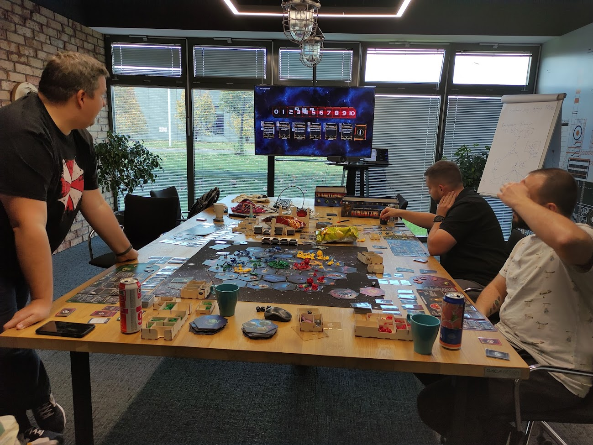

# ti4-companion

for live version see [https://ti4companion.willcodeforskipass.com/](https://ti4companion.willcodeforskipass.com/)

This is supposed to be a companion app for a session of [Twilight Imperium 4th Edition](https://twilight-imperium.fandom.com/wiki/Twilight_Imperium_Wiki#Fourth_Edition) board game.

It's supposed to be an easy way to share game state between players.
Each player should be able to input and access the game state of the current session on their phone.

This should help with tracking the objectives, laws and directives in play and, later, technologies developed by each race.

A way of sharing the game state in read-only state that would show the big picture on a big screen (or people who are interested in the game but are not sitting together).

## Features

see [issues](https://github.com/tarnas14/ti4-companion/issues)

## Sessions assisted by the app

<p>

<a href="https://ti4companion.willcodeforskipass.com/3c085427-6e9a-4716-ac8d-b7e2c0bda11b"></a>

</p>

# development

## to run the application

use provided `docker-compose.yml`, together with the committed `.env.dev` file, like this (in the root of the repo):

```bash
$ docker-compose --env-file .env.dev up -d
```

This will run postgres, backend and frontend services in dockers.
Check docker-compose which services are available on which host ports.

### initial data

If you run the application against an empty database, 2 sessions will be created with static Guids:

- `1811a152-b64c-41cd-bdfd-8885fdfb7620` with the same secret
- `6fd5c725-30cd-4320-8889-c2f6427ba365` with the same secret

so you can check the installation by trying to hit `https://localhost:3000/6fd5c725-30cd-4320-8889-c2f6427ba365` or the other one

## extracting faction images from codex pdf

The _nutshell_ images of factions (the ones shown on session view) are extracted from codex pdf.
The extraction was done using the `./extract-images-from-pdf.sh`.
More info below.

last used pdf: [https://images-cdn.fantasyflightgames.com/filer_public/ff/5c/ff5cc986-344a-4460-a0cb-41d40a3446ed/ti_codex_2_cards_web.pdf](https://images-cdn.fantasyflightgames.com/filer_public/ff/5c/ff5cc986-344a-4460-a0cb-41d40a3446ed/ti_codex_2_cards_web.pdf)

you need imagemagick or something like this (the thing in unix that installs `convert` and `pdftoppm` programs)

1. download a codex pdf like the one above
1. pray that the 24 factions are in the same order on the same pages
1. if on different pages, update script to extract from correct pages
1. if not in the same order as in the script - update the script with names which are lowercase of `FACTION` enum keys in `client/src/gameInfo/factions.js` (so `The_Universities_of_Jol__Nar` becomes `the_universities_of_jol__nar.png`)
1. run `./extract-images-from-pdf.sh <name_of_the_pdf_file>`
